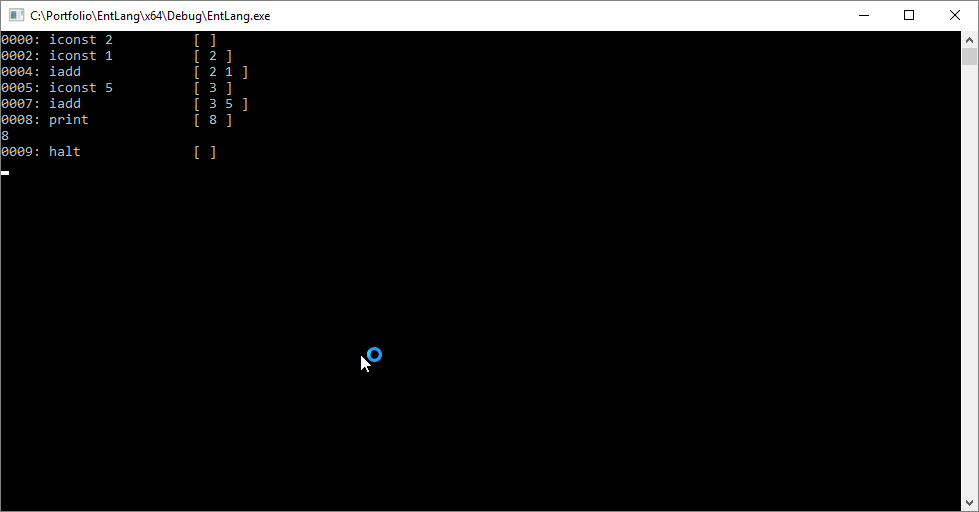
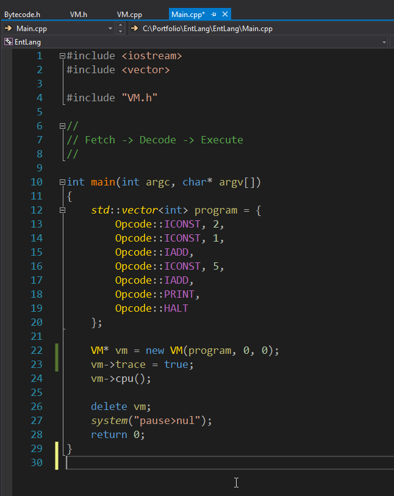

# EntLang

This was my first VM project. It is mostly a bare bone virtual machine with only 4 opcode instructions. I was interested in learning in how to make my own programming language, so the journey started with this. The most important aspect of this was learning the Fetch->Decode->Execute principle. With this knowledge I could start building this virtual machine (VM). The VM loads in a small program. It is encoded on a std::vector, with its opcodes and opands. The VM has an Instruction Stack (IS) where the code instructions are stored. Next the VM has a Data Stack (DS) for where it stores the data variables (not constants). And the last stack is the Stack which the program could use to store temporary data, you could say it is like an internal memory for the CPU. It is small but fast. Other parts are: Instruction Pointer (IP), Stack Pointer (SP), Frame Pointer (FP). Those are keeping track of the current status of the program running. Since I have used assembly language before I found this to be just like it. I found it really cool that this is actually how a CPU works in essence. For debugging purposes I added the disassembly function, it will print the opcode, IP and the mnemonic for the opcode. If this opcode has opands then it will print it. Then lastly, it will print the current stack, before actually printing this line. The program is simple, all it does is take 2+1+5 and we get 8 which is then printed out. Easy peasy!

Tags: C++, VM, Bytecode, CPU, Project
